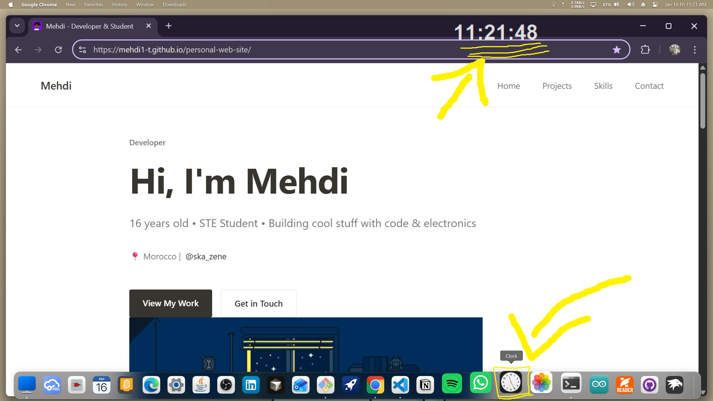
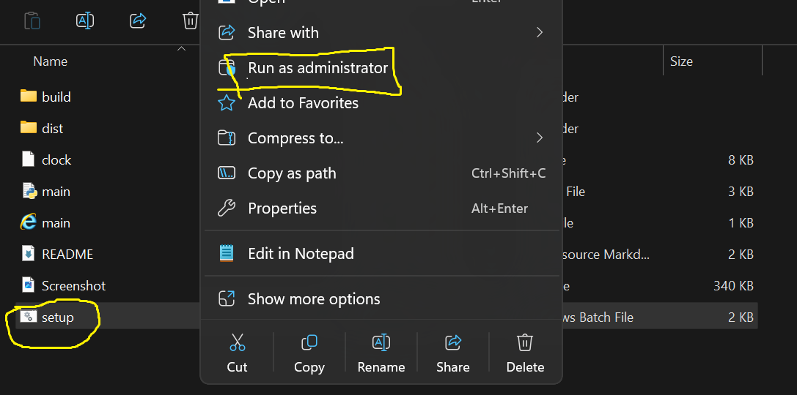

# Clock 🕖

A simple and beautiful Python clock application that displays the current time.

## Features

- Easy to run - one-click setup
- Clean & beautiful look
- Lightweight and fast
- Always on top option (if applicable)
- Change Fore color
- 



## How to Setup

1. Go to the GitHub repository: https://github.com/mehdi1-T/Clock
2. Download the ZIP file (Code → Download ZIP)
3. Right-click the ZIP and select **Extract All**
4. Open the extracted folder
5. Run `setup.bat` to create a desktop shortcut
6. Double-click the **Clock** shortcut on your desktop

That's it! Your clock is now ready to use.

## System Requirements

- Windows 7 or later
- No Python installation required (standalone EXE)

## Tools & Technologies

- Python
- Tkinter for UI
- Time module for time display
- PyInstaller for creating standalone executable

```python
import tkinter as tk
from datetime import datetime
import platform
```

## Troubleshooting

- If `setup.bat` doesn't work, make sure the `dist/main.exe` file exists
- Right-click `setup.bat` and select "Run as administrator" if you encounter permission issues
<p align="center">
  <br>
  
</p>

## Author

Mehdi Talalha

---

⭐ If you like this project, don't forget to give it a star on GitHub!